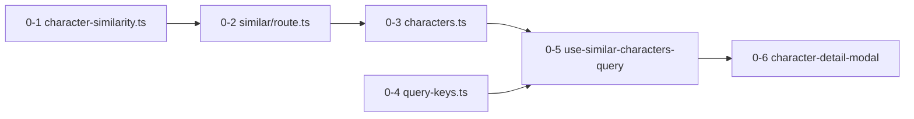

# 유사 캐릭터 추천 (API + 모달 사이드바)

> 캐릭터 상세 모달 우측 사이드바에 `/api/characters/[id]/similar` API를 추가한다.  
> 실제 데이터 기준으로 **tag**(주 신호) + mood + genres overlap 점수로 유사 캐릭터를 추천한다.

---

## 구현 순서 (P0 → P3)

의존성 순서대로 진행. **각 단계 완료 시 수동 검증 기준** 포함.

### P0 — 최소 출시 (E2E 동작)

> 목표: PC 모달 우측에 "Similar characters" 5개 노출. tag 기준 + 인기 fallback.

| #   | 작업           | 파일                                            | 완료 기준                                                                 |
| --- | -------------- | ----------------------------------------------- | ------------------------------------------------------------------------- |
| 0-1 | 유사도 유틸    | `lib/character-similarity.ts`                   | tag/mood/genre 점수 + `rankSimilarCharacters()` 동작                      |
| 0-2 | Similar API    | `app/api/characters/[id]/similar/route.ts`      | `GET ?limit=5` → 200 + `Character[]`, self 제외, tag pool + 인기 fallback |
| 0-3 | API 클라이언트 | `lib/api/characters.ts`                         | `getSimilarCharacters(id, { limit? })`                                    |
| 0-4 | Query key      | `lib/api/query-keys.ts`                         | `characters.similar(id)`                                                  |
| 0-5 | Query hook     | `hooks/queries/use-similar-characters-query.ts` | `staleTime: 60_000`, characterId 변경 시 refetch                          |
| 0-6 | 모달 UI        | `components/character-detail-modal.tsx`         | aside 하단 Similar 섹션, `CharacterDetailLink` 클릭 시 오버레이 전환      |

**P0에서 의도적으로 제외:**

- `exclude` 쿼리 파라미 (클라이언트 filter로 대체)
- `character-recommend-row` 추출 (row 마크업 인라인 복사)
- `placeholderData` (목록 캐시 prefetch)
- genre overlap DB 쿼리 (데이터 없음)
- Skeleton 로딩 (로딩 중 섹션 숨김)

**P0 수동 테스트:**

1. tag 있는 캐릭터 모달 → 같은 tag 캐릭터 노출
2. tag 없는 캐릭터 → 인기순 fallback
3. 유일한 tag 캐릭터 → self 제외 후 fallback
4. creator 없는 캐릭터 → Similar 섹션만 표시
5. PC 오버레이에서 similar 클릭 → 모달 전환

---

### P1 — UX polish

| #   | 작업               | 내용                                                                                 |
| --- | ------------------ | ------------------------------------------------------------------------------------ |
| 1-1 | Row 컴포넌트 추출  | `components/characters/character-recommend-row.tsx` — moreFromCreator / similar 공용 |
| 1-2 | API exclude 파라미 | `?exclude=uuid1,uuid2` — moreFromCreator 중복 서버 차단                              |
| 1-3 | placeholderData    | `useCharactersQuery` 캐시 + `rankSimilarCharacters` → 모달 전환 깜빡임 감소          |
| 1-4 | Skeleton 로딩      | 3행 skeleton, 로딩 중에도 aside 공간 유지                                            |
| 1-5 | query key exclude  | `characters.similar(id, excludeKey)` — exclude 변경 시 캐시 분리                     |

---

### P2 — 데이터 품질

| #   | 작업               | 내용                                                              |
| --- | ------------------ | ----------------------------------------------------------------- |
| 2-1 | genre overlap 쿼리 | API에 `.overlaps('genres', ...)` 추가 (genres 채워지면 자동 강화) |
| 2-2 | 생성 폼 genre 선택 | `character-create-form` + POST API — genres 저장 (별도 이슈 가능) |
| 2-3 | 모바일 Similar     | `character-detail-mobile.tsx` horizontal scroll 섹션              |

---

### P3 — 스케일 / 고도화

- Postgres RPC (1만+ 캐릭터 시 scoring DB 이관)
- pgvector + description embedding
- co-like / co-chat 협업 필터

---

## 의존성 그래프 (P0)



---

## 2차 재검토 (2025-06-28)

### 확인 OK

| 항목                | 상태                                                               |
| ------------------- | ------------------------------------------------------------------ |
| 라우트 충돌         | `[id]/similar/route.ts` ↔ `[id]/route.ts` 분리 OK                  |
| Supabase 클라이언트 | 공개 read → `lib/supabase.ts` anon (기존 list API와 동일)          |
| 오버레이 전환       | `CharacterDetailLink` + `CharacterDetailOverlayProvider` 이미 연결 |
| tag 데이터          | 생성 폼 8종 고정값, DB `tag` 컬럼 존재                             |
| SQL migration       | 불필요 (tag equality + 기존 genres array)                          |

### 수정/보완 사항

#### 1. creator 없을 때 Similar는 반드시 표시 (P0 AC)

현재 aside는 `creatorName` 없으면 거의 빈 공간.

```tsx
// character-detail-modal.tsx — creator 섹션은 creatorName 있을 때만
{creatorName ? ( ... ) : null}
```

**→ Similar 섹션은 creator 유무와 무관하게 렌더.** P0 AC에 포함.

#### 2. P0 exclude는 클라이언트만으로 충분

`moreFromCreator` 최대 3개. P0 API는 self만 제외하고, 모달에서:

```tsx
const visibleSimilar = similarCharacters.filter(
  (item) => !moreFromCreator.some((c) => c.id === item.id),
);
```

P1에서 API `exclude` 추가해 네트워크/캐시 효율 개선.

#### 3. genre overlap — P0 스킵 확정

`genres: []` 고정 저장. P0 API에 overlap 쿼리 넣어도 항상 0건 → **P2로 미룸.**  
유틸(`character-similarity.ts`)에는 genre scoring 로직 포함 (placeholderData·P2 대비).

#### 4. tag pool이 limit 미만일 때

예: Romance tag 캐릭터 2개뿐 → tag pool 1개(self 제외) + fallback 보충 → rank → 5개 채움.

P0 API 로직:

```
candidates = tagMatches (max 30)
if candidates.length < limit * 2:
  candidates += popular (max 30, dedupe)
return rank(source, candidates, { limit, excludeIds: [self] })
```

#### 5. query key 설계

P0:

```ts
similar: (id: string) => [...queryKeys.characters.all, "similar", id] as const;
```

P1 exclude 추가:

```ts
similar: (id: string, excludeKey = "") =>
  [...queryKeys.characters.all, "similar", id, excludeKey] as const;
// excludeKey = [...excludeIds].sort().join(',')
```

#### 6. API 응답 shape

list API와 동일하게 `select('*')` + count 필드 normalize (`like_count ?? 0` 등).  
모달 row는 `id`, `name`, `profile_image_url`만 쓰지만, hook 재사용·캐시 일관성 위해 full row 유지.

#### 7. 에러 UX

- API 404 (invalid id) → hook error → **섹션 숨김** (모달 유지)
- API 500 → 동일
- 빈 배열 200 → 섹션 숨김

#### 8. 인덱스 (선택, P0 블로cker 아님)

캐릭터 수 증가 시 `characters(tag)` WHERE `is_public = true` partial index 고려.  
현재 규모에선 full scan OK.

---

## 재검토 핵심 발견 (1차)

### 1. `genres`는 사실상 비어 있음

```ts
// app/api/characters/route.ts
genres: [],
```

생성 폼 genre UI 없음 → **v1 주 신호는 `tag`**.

### 2. `tag`가 실질적 분류 키

8종: `Emotional`, `Direct`, `Knowledge`, `Humor`, `Fantasy`, `Romance`, `Thriller`, `Slice of life`

### 3. `mood`는 보조 (freeform 20자)

pool 필터 X, scoring 가산점만 (+15).

### 4. `moreFromCreator`는 클라이언트 유지

유사 추천만 API. 중복: P0 클라이언트 filter → P1 API exclude.

---

## 스펙 상세

### 유사도 점수 — `lib/character-similarity.ts`

| 신호                              | 점수                 |
| --------------------------------- | -------------------- |
| tag 일치 (case-insensitive trim)  | +40                  |
| genre 1개 겹침                    | +10 × 겹침 수        |
| mood 일치 (case-insensitive trim) | +15                  |
| 동점                              | `message_count` DESC |

```ts
getCharacterSimilarityScore(source, candidate): number
rankSimilarCharacters(source, candidates, { limit, excludeIds? }): Character[]
```

### API — `GET /api/characters/[id]/similar`

**P0:** `?limit=5` (default 5, max 10)

**P1:** `&exclude=uuid1,uuid2`

처리: source 조회 → tag pool → (P2: genre overlap) → fallback 보충 → rank → 응답

### UI — 모달 사이드바

[`components/character-detail-modal.tsx`](../components/character-detail-modal.tsx) aside 순서:

1. Creator (있을 때)
2. More from creator (있을 때)
3. **Similar characters** (결과 있을 때)

P0 hook 사용:

```tsx
const {
  data: similarCharacters = [],
  isPending,
  isError,
} = useSimilarCharactersQuery(character.id);

const visibleSimilar = useMemo(
  () =>
    similarCharacters.filter(
      (item) => !moreFromCreator.some((c) => c.id === item.id),
    ),
  [similarCharacters, moreFromCreator],
);

// isPending || isError || visibleSimilar.length === 0 → 섹션 숨김
```

---

## 리스크 & 완화

| 리스크               | 완화                            |
| -------------------- | ------------------------------- |
| tag 미설정           | 인기 fallback                   |
| tag 동일 다수        | message_count tiebreak          |
| moreFromCreator 중복 | P0 클라 filter / P1 API exclude |
| genres 비어 있음     | tag-first, overlap P2           |
| mood 오타            | exact match only                |
| aside 로딩 빈 공간   | P1 skeleton                     |

---

## 예상 diff (P0만)

| 구분 | 파일                                                                                                                       |
| ---- | -------------------------------------------------------------------------------------------------------------------------- |
| 신규 | `lib/character-similarity.ts`, `app/api/characters/[id]/similar/route.ts`, `hooks/queries/use-similar-characters-query.ts` |
| 수정 | `lib/api/characters.ts`, `lib/api/query-keys.ts`, `components/character-detail-modal.tsx`                                  |

P0 diff ~200–250 lines. P1에서 +recommend-row, exclude, skeleton ~80 lines 추가.
